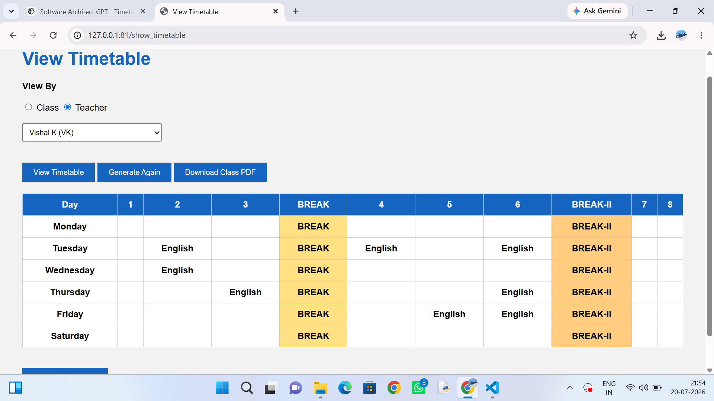

# school-timetable-generator
# School Timetable Management System

A web-based School Timetable Management System developed using **Python, Flask, SQLite, HTML, and CSS**. The system helps schools manage teachers, subjects, classes, and automatically generate conflict-free timetables.

---

## Features

- School initialization
- Teacher management
- Subject management
- Class management
- Teacher–Subject assignment
- Teacher–Class assignment
- Automatic timetable generation
- Class timetable view
- Teacher timetable view
- Export Class Timetable PDF
- Export Teacher Timetable PDF
- Regenerate timetable
- Configurable break periods

---

## software Used

- Python
- Flask
- SQLite
- HTML5
- CSS3
- ReportLab (PDF Generation)

---

## Screenshots

## 📸 Screenshots

### Dashboard


---

### School Setup


---

### Teacher Management


---

### View Timetable



---

## Installation

1. Clone the repository

```bash
git clone https://github.com/YOUR_USERNAME/school-timetable-system.git
```

2. Open the project

```bash
cd school-timetable-system
```

3. Install dependencies

```bash
pip install -r requirements.txt
```

4. Run the application

```bash
python app.py
```

5. Open your browser and visit

```
http://127.0.0.1:5000
```

---

## Project Structure

```
SchoolTimetable/
│
├── app.py
├── database.py
├── school.db
├── templates/
├── static/
├── db/
├── timetable/
└── pdf/
```

---

##Made by

**PB(Parbesh Behera)**

School Timetable Management System
