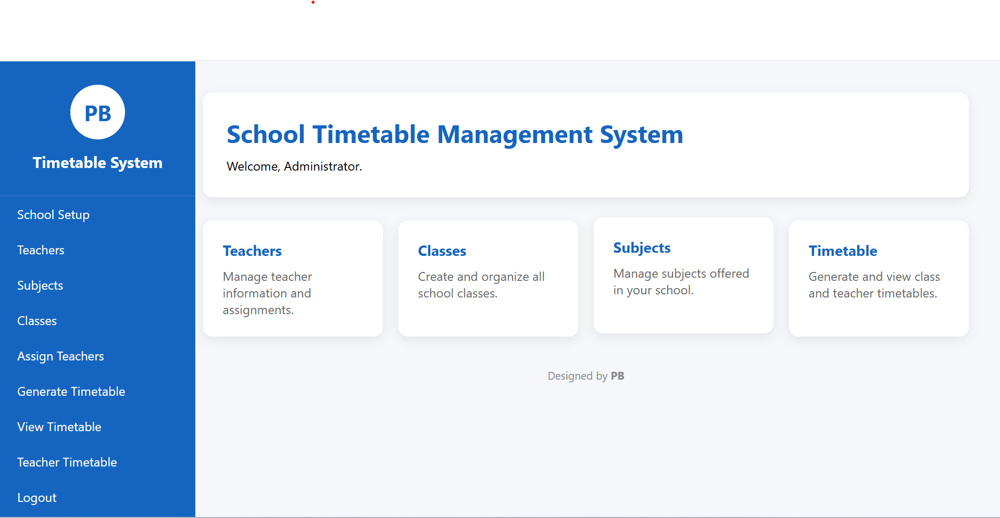
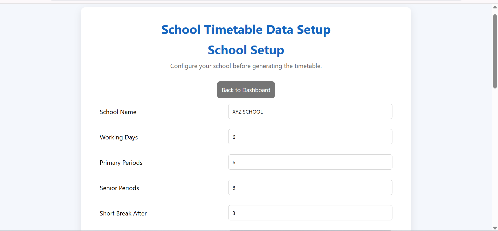
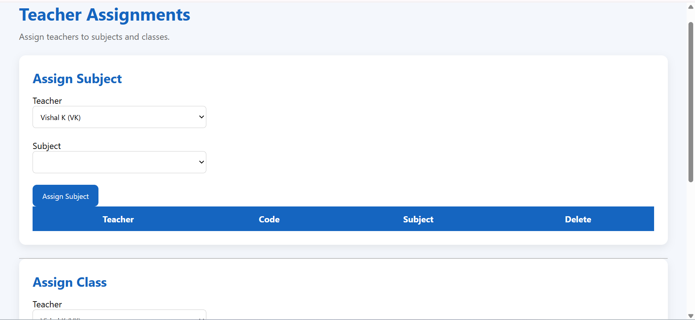
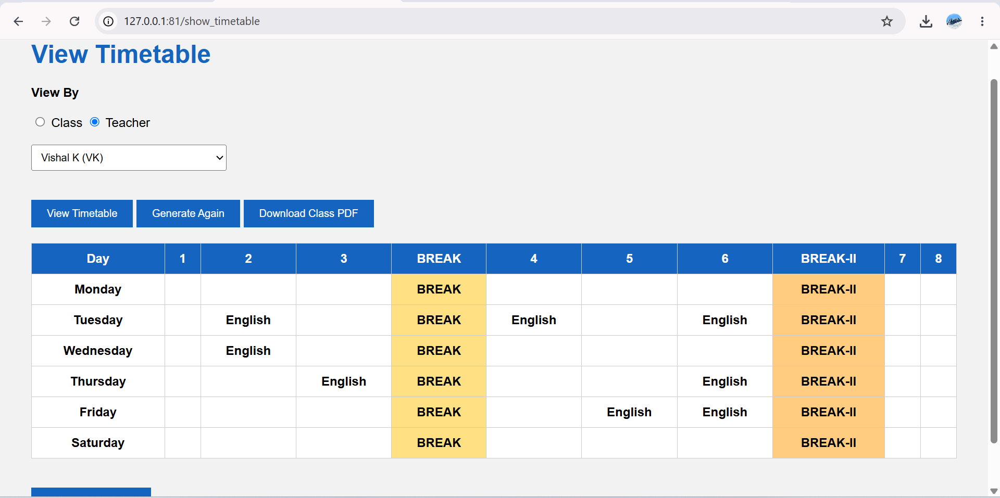

# school-timetable-generator
# School Timetable Management System

A web-based School Timetable Management System developed using **Python, Flask, SQLite, HTML, and CSS**. The system helps schools manage teachers, subjects, classes, and automatically generate conflict-free timetables.

---

## Features

- School initialization
- Teacher management
- Subject management
- Class management
- Teacher–Subject assignment
- Teacher–Class assignment
- Automatic timetable generation
- Class timetable view
- Teacher timetable view
- Export Class Timetable PDF
- Export Teacher Timetable PDF
- Regenerate timetable
- Configurable break periods

---

## software Used

- Python
- Flask
- SQLite
- HTML5
- CSS3
- ReportLab (PDF Generation)

---

## Screenshots

## 📸 Screenshots

### Dashboard



---

### School Setup



---

### Teacher Management



---

### View Timetable



---


## Project Structure

```
SchoolTimetable/
│
├── app.py
├── database.py
├── school.db
├── templates/
├── static/
├── db/
├── timetable/
└── pdf/
```

---

##Made by

**PB(Parbesh Behera)**
**#Disclamer/Note:-** This project was developed by me as a school project and it demonstrates the core functionality of automatic timetable generation. Some advanced scheduling scenarios and uncommon real-world constraints (such as complex teacher preferences or specialized scheduling rules. for examlple:-two teachers for the same subject or a single teacher assigned with more than 1 subject,etc.) are not fully implemented in this public version. The project is actively being improved, and future updates may address these edge cases if required.

School Timetable Management System
